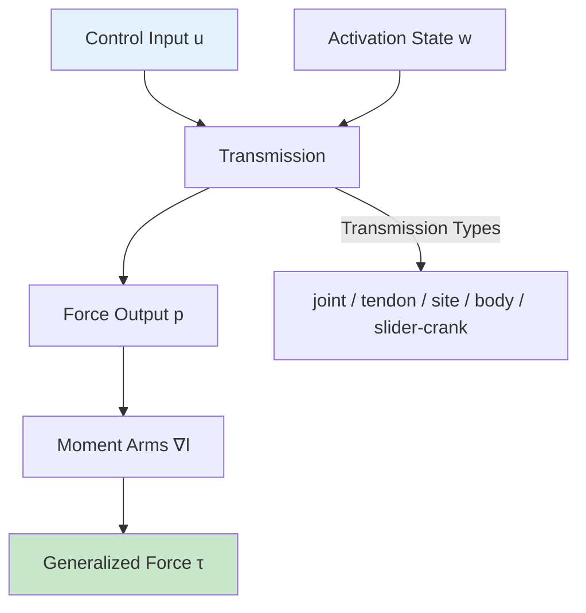
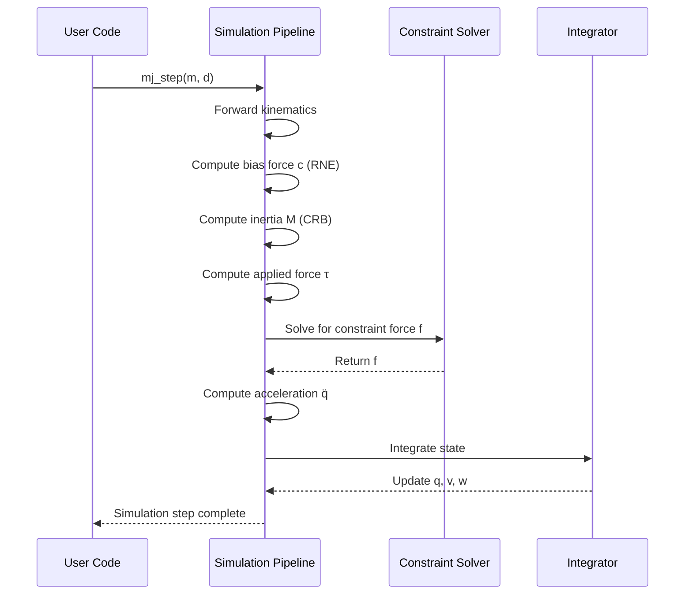

# Computation

This chapter describes the mathematical and algorithmic foundations of MuJoCo. The overall framework is fairly standard for readers familiar with modeling and simulation in generalized or joint coordinates.

## Soft Contact Model

Robots as well as humans interact with their environment primarily through physical contact. The contact model underlying MuJoCo has benefits along these dimensions:

### Physical Realism and Soft Contacts

MuJoCo drops the strict complementarity constraint at the heart of the LCP formulation. For frictionless contacts this makes no difference, but for frictional contacts there are differences. The immediate consequence of dropping strict complementarity and replacing it with a cost is that complementarity can be violated — meaning that force and velocity in the contact normal direction can be simultaneously positive.

### Computational Efficiency

LCP models with frictional contact correspond to NP-hard optimization problems. To be fair, NP-hardness is a statement about worst-case performance. Convex optimization has well-established advantages. In MuJoCo, for typical robotic models, 10 sweeps of a projected Gauss-Seidel method yield solutions which for practical purposes are indistinguishable from the global minimum.

### Continuous Time

The present model is defined in **continuous-time**, in terms of forces and accelerations. This is more natural given that time in the real world is continuous. It is also the preferred formulation in the controls literature.

### Inverse Dynamics and Optimization

The contact model has a **uniquely-defined inverse**. The inverse dynamics are in fact easier to compute than the forward dynamics, because the optimization problem becomes diagonal and decomposes into independent optimization problems over individual contacts — which can be solved analytically.

## General Framework

### Notation

| Symbol | Size | Description | MuJoCo field |
|--------|------|-------------|--------------|
| `nq` | | number of position coordinates | `mjModel.nq` |
| `nv` | | number of degrees of freedom | `mjModel.nv` |
| `nc` | | number of active constraints | `mjData.nefc` |
| `q` | `nq` | joint position | `mjData.qpos` |
| `v` | `nv` | joint velocity | `mjData.qvel` |
| `τ` | `nv` | applied force | `qfrc_passive + qfrc_actuator + qfrc_applied` |
| `c(q,v)` | `nv` | bias force | `mjData.qfrc_bias` |
| `M(q)` | `nv×nv` | inertia in joint space | `mjData.qM` |
| `J(q)` | `nc×nv` | constraint Jacobian | `mjData.efc_J` |
| `r(q)` | `nc` | constraint residual | `mjData.efc_pos` |
| `f(q,v,τ)` | `nc` | constraint force | `mjData.efc_force` |

### Equations of Motion

The general equations of motion in continuous time are:

```
M q̈ + c = τ + Jᵀf
```

Where:
- **M** is the joint-space inertia matrix (always invertible)
- **c** is the bias force (Coriolis, centrifugal, gravitational)
- **τ** is the applied force
- **Jᵀf** is the constraint force in joint coordinates

### Recursive Algorithms

| Algorithm | Purpose | Computational Cost |
|-----------|---------|-------------------|
| **RNE** (Recursive Newton-Euler) | Compute bias force `c` | O(n) |
| **CRB** (Composite Rigid-Body) | Compute inertia matrix `M` | O(n) |
| **LDLᵀ factorization** | Solve `Mx = b` efficiently | O(n) |

## Numerical Integration

MuJoCo supports four integrators:

| Integrator | Description | Recommended Use |
|------------|-------------|-----------------|
| **Euler** | Semi-implicit with implicit joint damping | Compatibility with older models |
| **implicitfast** | Fast implicit-in-velocity | **Default recommendation** — best tradeoff of stability and performance |
| **implicit** | Full implicit-in-velocity | Coupled rotational systems (multi-link pendula) |
| **RK4** | 4th-order Runge-Kutta | Energy-conserving systems |

::: tip Choosing Integrator
The recommended integrator is `implicitfast` which usually has the best tradeoff of stability and performance. For energy-conserving systems, `RK4` is qualitatively better.
:::

## Constraint Model

MuJoCo has a very flexible constraint model. Each conceptual constraint contributes one or more scalar constraints towards the total count `nc`.

### Constraint Types (in order)

1. **Equality constraints** — loop joints, mechanical coupling
2. **Friction loss** — Coulomb friction in DOFs and tendons
3. **Limit constraints** — joint and tendon limits
4. **Contact constraints** — frictional contacts

### Equality Constraints

| Type | Dimension | Description |
|------|-----------|-------------|
| `connect` | 3 | Create ball joint between two bodies |
| `weld` | 6 | Fix relative pose of two bodies |
| `joint` | 1 | Fix position of a joint |
| `tendon` | 1 | Fix length of a tendon |
| `slide` | 1 or 2 | Couple joint/tendon positions via polynomial |

### Solver Algorithms

| Solver | Description |
|--------|-------------|
| **Newton** | Quadratic convergence; default for most models |
| **CG** (Conjugate Gradient) | Good for TPU; lower memory |
| **PGS** (Projected Gauss-Seidel) | Fast for large-scale; limited accuracy |

## Actuation Model

MuJoCo provides a flexible actuator model with three independent components:



### Transmission Types

| Type | Description |
|------|-------------|
| `joint` | Force/torque on a joint |
| `tendon` | Force on a tendon |
| `site` | Cartesian force/torque at a site |
| `body` | Forces at contact points on a body |
| `slider-crank` | Linear-to-torque conversion |
| `jointinparent` | Rotation measured in parent frame (ball/free joints) |

### Activation Dynamics

| Type | Dynamics Equation |
|------|-------------------|
| `none` | No activation state |
| `integrator` | ẇᵢ = uᵢ |
| `filter` | ẇᵢ = (uᵢ - wᵢ) / τ |
| `filterexact` | ẇᵢ = (uᵢ - wᵢ)(1 - e^(-h/τ)) |
| `muscle` | Hill-type muscle model |
| `user` | User-defined callback |

## Passive Forces

Passive forces depend only on position and velocity:

| Source | Description |
|--------|-------------|
| **Spring-dampers** | Joint and tendon compliance |
| **Gravity compensation** | `gravcomp` attribute on bodies |
| **Fluid forces** | Viscous drag, inertia, lift |

## Simulation Pipeline


