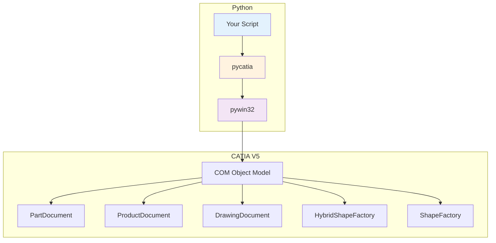

# Introduction

pycatia is a Python module that provides an interface to the CATIA V5 COM (Component Object Model) automation API. It allows you to automate CATIA V5 tasks programmatically, from simple part modifications to complex product structure manipulation.

## What is CATIA V5?

CATIA V5 is a professional CAD/CAE/CAM software developed by Dassault Systèmes. It is widely used in aerospace, automotive, and manufacturing industries for 3D design, simulation, and manufacturing.

## What does pycatia do?

pycatia wraps the CATIA V5 COM interface in Python classes, providing:

- **Type-safe API** — Comprehensive type hints for better IDE support
- **Pythonic interface** — Natural Python syntax for CATIA operations
- **Auto-generated wrappers** — Generated from CATIA's COM interface definitions
- **Extensive coverage** — 80+ interface modules

## Key Features

| Feature | Description |
|---------|-------------|
| 🐍 Python 3.9+ | Modern Python with full type hinting support |
| 🔧 COM Automation | Full access to CATIA V5 COM interfaces |
| 📦 80+ Interfaces | Coverage of major CATIA workbenches |
| ✅ Type Hints | IDE autocomplete and type checking |
| 🔄 Context Manager | Automatic document cleanup |
| 📝 Logging | Built-in logging support |

## Architecture



## Project Structure

```
pycatia/
├── pycatia/
│   ├── __init__.py          # Main entry point
│   ├── base_interfaces/     # Application, context handler
│   ├── mec_mod_interfaces/  # Mechanical design
│   ├── hybrid_shape_interfaces/  # Hybrid shapes
│   ├── sketcher_interfaces/ # Sketcher
│   ├── drafting_interfaces/ # Drafting
│   ├── product_structure_interfaces/ # Product structure
│   ├── knowledge_interfaces/ # Knowledge engine
│   ├── manufacturing_interfaces/ # Manufacturing
│   └── ...                  # 80+ more interfaces
├── examples/                # Example scripts
├── user_scripts/            # User-contributed scripts
├── tests/                   # Test suite
└── docs/                    # Documentation
```

## Who is this for?

- **CAD Engineers** — Automate repetitive part modifications
- **CAE Analysts** — Setup and run simulations programmatically
- **Manufacturing Engineers** — Generate NC code and manufacturing plans
- **Developers** — Build custom tools on top of CATIA

## Limitations

::: warning Important
pycatia is **alpha software**. While it works well for the interfaces that have been tested, there may be bugs in untested areas.

- Requires **CATIA V5 running on Windows**
- Only tested on specific CATIA versions
- Some edge cases may not be covered
:::

## Next Steps

- [Installation](/guide/installation) — Set up pycatia
- [Quick Start](/guide/quick-start) — First script
- [Examples](/examples/overview) — Browse example code
- [API Reference](/api/application) — Detailed API docs
