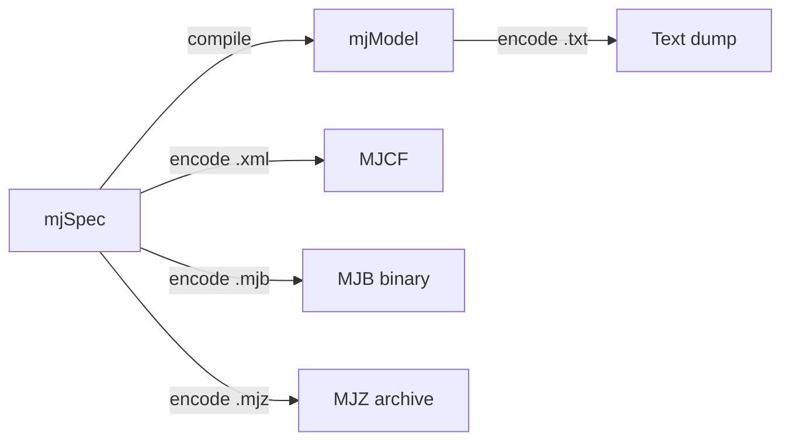

# Modeling

This chapter provides a detailed overview of MuJoCo's modeling capabilities.

## MJCF: MuJoCo's Modeling Language

MJCF (MuJoCo XML Format) is an XML file format designed to be as human readable and editable as possible. URDF model files can also be loaded.

### Default Settings

MJCF has an extensive default setting mechanism that resembles CSS inlined in HTML. This means users need to set surprisingly few attributes in any given model.

```xml
<mujoco model="example">
  <default>
    <geom rgba=".8 .6 .4 1"/>
  </default>

  <worldbody>
    <light pos="0 1 1" dir="0 -1 -1" diffuse="1 1 1"/>
    <body pos="0 0 1">
      <joint type="ball"/>
      <geom type="capsule" size="0.06" fromto="0 0 0  0 0 -.4"/>
      <body pos="0 0 -0.4">
        <joint axis="0 1 0"/>
        <joint axis="1 0 0"/>
        <geom type="capsule" size="0.04" fromto="0 0 0  .3 0 0"/>
      </body>
    </body>
  </worldbody>
</mujoco>
```

## Model Elements Reference

### Option

Each model has three sets of options:

| Structure | Contents |
|-----------|----------|
| `mjOption` | Physics simulation options (algorithms, parameters, gravity) |
| `mjVisual` | Visualization options (colors, rendering flags) |
| `mjStatistic` | Compiler-computed statistics (mass, extent) |

### Assets

| Asset Type | Description |
|------------|-------------|
| **Mesh** | Triangulated meshes from OBJ/STL files |
| **Skin** | Deformable skinned meshes for visualization |
| **Height field** | Terrain elevation data from PNG |
| **Texture** | Image textures (PNG or procedural) |
| **Material** | Surface appearance (RGBA, specularity, emission) |

### Geom Types

| Type | Parameters | Description |
|------|-----------|-------------|
| `plane` | `size` | Infinite flat surface |
| `sphere` | `size` (radius) | Sphere geometry |
| `capsule` | `size`, `fromto`/`to` | Cylinder with hemispherical caps |
| `ellipsoid` | `size` (semi-axes) | Ellipsoid geometry |
| `cylinder` | `size` (radius, half-length) | Cylinder geometry |
| `box` | `size` (half-sizes) | Box geometry |
| `mesh` | `mesh` (asset reference) | Loaded mesh geometry |
| `hfield` | `hfield` (asset reference) | Height field terrain |

### Joint Types

| Type | DOFs | Description |
|------|------|-------------|
| `free` | 6 | Floating body (3 translation + 3 rotation) |
| `ball` | 3 | Spherical joint (quaternion orientation) |
| `slide` | 1 | Prismatic joint (linear motion) |
| `hinge` | 1 | Revolute joint (angular motion) |

## Building Models

### Compilation Pipeline



### Model Instances

There are several entities called "model" in MuJoCo:

| Level | Format | Description |
|-------|--------|-------------|
| High-level File | MJCF/URDF, MJZ | Human-readable source |
| High-level Memory | `mjSpec` | C struct mirroring MJCF |
| Low-level File | MJB | Binary (version-specific) |
| Low-level Memory | `mjModel` | Runtime computation struct |

## Model Editing API

The C API provides functions for creating and modifying models at runtime:

```c
// Create a new model spec
mjtObj obj = mjOBJ_BODY;
int body = mj_addObj(m, obj, mjROOT, -1, NULL, 0);

// Add a geom to a body
int geom = mj_addObj(m, mjOBJ_GEOM, body, -1, NULL, 0);
m->geom_type[geom] = mjGEOM_SPHERE;
m->geom_size[3*geom] = 0.1;  // radius

// Compile to mjModel
mjModel* model = mj_compile(m, NULL);
```

The Python bindings provide a higher-level API via `mujoco.MjSpec`:

```python
import mujoco

spec = mujoco.MjSpec()
spec.modelname = "my model"

body = spec.worldbody.add_body(
    pos=[1, 2, 3],
    quat=[0, 1, 0, 0],
)
geom = body.add_geom(
    name='my_geom',
    type=mujoco.mjtGeom.mjGEOM_SPHERE,
    size=[1, 0, 0],
    rgba=[1, 0, 0, 1],
)

model = spec.compile()
```

## Composite Flexible Objects

MuJoCo's soft constraints can model ropes, cloth, and deformable 3D objects. The modeling language has high-level macros which are automatically expanded by the model compiler:

```xml
<!-- Rope macro -->
<mujoco>
  <worldbody>
    <body pos="0 0 1">
      <joint type="free"/>
      <geom type="sphere" size="0.01"/>
    </body>
    <!-- ... more bodies connected by tendons ... -->
  </worldbody>
  <tendon>
    <fixed>
      <joint joint="j1"/>
      <joint joint="j2" coeff="-1"/>
      <!-- ... -->
    </fixed>
  </tendon>
</mujoco>
```
