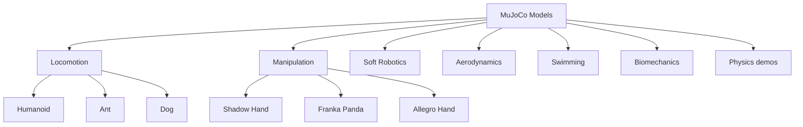

# Model Gallery

MuJoCo ships with a collection of demonstration models in the `model/` directory of the repository.

## Featured Models

### Humanoid

The flagship MuJoCo model — a 27-body, 28-DoF humanoid capable of walking, running, and recovering from disturbances.

```bash
simulate model/humanoid/humanoid.xml
```

**Features:**
- 27 bodies, 28 degrees of freedom
- Full-body actuation (21 actuators)
- Designed for locomotion research

### Humanoid Complexity

An extended version with increased complexity:

```bash
simulate model/humanoid_complexity/humanoid_complexity.xml
```

### Ant

A quadruped robot model:

```bash
simulate model/ant/ant.xml
```

**Features:**
- 8 degrees of freedom
- 12 actuators
- Designed for locomotion benchmarking

### Shadow Hand

A dexterous hand model:

```bash
simulate model/shadow_hand/shadow_hand.xml
```

**Features:**
- 27 DoF
- 46 geoms
- 26 actuators
- Tendon-based actuation

### Franka Emika Panda

A popular robotic manipulator:

```bash
simulate model/franka_emika_panda/panda.xml
```

**Features:**
- 7 DoF
- Force-torque sensing
- gripper actuation

### Atlas

A full-body humanoid robot:

```bash
simulate model/atlas/v10_atlas_mjpro150.xml
```

## Model Categories

| Category | Models | Description |
|----------|--------|-------------|
| **Locomotion** | humanoid, ant, dog, quadruped | Bipedal and quadrupedal robots |
| **Manipulation** | shadow_hand, franka_emika_panda, allegro_hand | Dexterous hands and arms |
| **Soft Robotics** | soft_robot, soft_finger | Compliant and deformable robots |
| **Aerodynamics** | helicopter, quadcopter | Aerial vehicles |
| **Swimming** | fish, swimmer | Aquatic robots |
| **Biomechanics** | gait, leg | Human and animal models |
| **Physics** | pendulum, collisions, soft | Demonstrations of physics features |

## Model Gallery Display

::: tip Explore More
All models are available in the [MuJoCo GitHub repository](https://github.com/google-deepmind/mujoco/tree/main/model).
:::



## Running Models

```bash
# Using the simulate viewer
simulate model/humanoid/humanoid.xml

# Using Python
python -c "
import mujoco
import mujoco.viewer
model = mujoco.MjModel.from_xml_path('model/humanoid/humanoid.xml')
data = mujoco.MjData(model)
with mujoco.viewer.launch_passive(model, data) as viewer:
    while viewer.is_running():
        mujoco.mj_step(model, data)
        viewer.sync()
"
```
