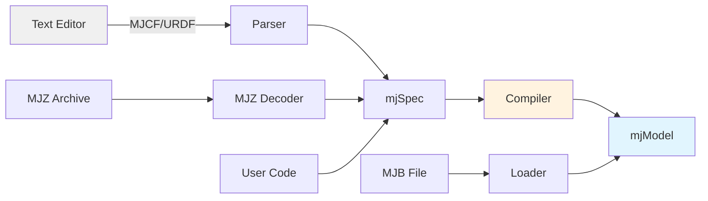

# Overview

**MuJoCo** stands for **Mu**lti-**Jo**int dynamics with **Co**ntact. It is a general purpose physics engine that aims to facilitate research and development in robotics, biomechanics, graphics and animation, machine learning, and other areas that demand fast and accurate simulation of articulated structures interacting with their environment.

Initially developed by Roboti LLC, it was acquired and made freely available by Google DeepMind in October 2021, and open sourced in May 2022. The MuJoCo codebase is available at the [google-deepmind/mujoco](https://github.com/google-deepmind/mujoco) repository on GitHub.

MuJoCo is a C/C++ library with a C API, intended for researchers and developers. The runtime simulation module is tuned to maximize performance and operates on low-level data structures which are preallocated by the built-in XML parser and compiler.

## Key Features

MuJoCo has a long list of features. Here we outline the most notable ones.

### Generalized Coordinates with Modern Contact Dynamics

Physics engines have traditionally separated in two categories. Robotics and biomechanics engines use efficient and accurate recursive algorithms in generalized or joint coordinates. However they either leave out contact dynamics, or rely on the earlier spring-damper approach which requires very small time-steps. Gaming engines use a more modern approach where contact forces are found by solving an optimization problem. However, they often resort to the over-specified Cartesian representation where joint constraints are imposed numerically, causing inaccuracies and instabilities.

**MuJoCo pioneered the combination of simulation in generalized coordinates with optimization-based contact dynamics.** This approach has since been adopted by other simulators.

### Soft, Convex and Analytically-Invertible Contact Dynamics

In the modern approach to contact dynamics, the forces or impulses caused by frictional contacts are usually defined as the solution to a linear or non-linear complementarity problem (LCP or NCP), both of which are NP-hard. MuJoCo is based on a different formulation of the physics of contact which reduces to a **convex optimization problem**.

::: tip Key Insight
The contact model allows soft contacts and other constraints, and has a uniquely-defined inverse facilitating data analysis and control applications. The default Newton solver provides quadratic convergence.
:::

Alternative algorithms include:
- **Conjugate Gradient** method
- **Projected Gauss-Seidel** method that can handle elliptic friction cones

### Tendon Geometry

MuJoCo can model the 3D geometry of tendons — which are minimum-path-length strings obeying wrapping and via-point constraints. The mechanism is similar to the one in OpenSim but implements a more restricted, closed-form set of wrapping options to speed up computation. It also offers robotics-specific structures such as pulleys and coupled degrees of freedom.

### General Actuation Model

Designing a sufficiently rich actuation model while using a model-agnostic API is challenging. MuJoCo achieves this goal by adopting an abstract actuation model that can have different types of transmission, force generation, and internal dynamics.

### Performance

MuJoCo's runtime performs **zero memory allocations after initialization** — all working memory is preallocated in `mjData`. A single simulation step is single-threaded by default, but constraint islands enable per-island parallelism within a step.

## Model Compilation Pipeline



| Entity | High Level | Low Level |
|--------|-----------|-----------|
| **File** | MJCF/URDF (XML), MJZ (Zip) | MJB (binary) |
| **Memory** | `mjSpec` (C struct) | `mjModel` (C struct) |

## Examples

### Hello World Model

Here is a simple model in MuJoCo's MJCF format:

```xml
<mujoco>
  <worldbody>
    <light diffuse=".5 .5 .5" pos="0 0 3" dir="0 0 -1"/>
    <geom type="plane" size="1 1 0.1" rgba=".9 0 0 1"/>
    <body pos="0 0 1">
      <joint type="free"/>
      <geom type="box" size=".1 .2 .3" rgba="0 .9 0 1"/>
    </body>
  </worldbody>
</mujoco>
```

### Minimal C Simulation

```c
#include "mujoco.h"
#include "stdio.h"

char error[1000];
mjModel* m;
mjData* d;

int main(void) {
  m = mj_loadXML("hello.xml", NULL, error, 1000);
  if (!m) {
    printf("%s\n", error);
    return 1;
  }

  d = mj_makeData(m);

  while (d->time < 10)
    mj_step(m, d);

  mj_deleteData(d);
  mj_deleteModel(m);

  return 0;
}
```

## Model Elements

MuJoCo models consist of the following element categories:

### Kinematic Tree Elements

| Element | Description |
|---------|-------------|
| **Body** | Rigid bodies with mass and inertial properties |
| **Joint** | Motion degrees of freedom: ball, slide, hinge, free |
| **DOF** | Degrees of freedom (velocity/force level) |
| **Geom** | 3D shapes for collision and rendering |
| **Site** | Reference points in body frames |
| **Camera** | Virtual cameras for observation |
| **Light** | Lighting sources |

### Stand-alone Elements

| Element | Description |
|---------|-------------|
| **Tendon** | Scalar length elements for actuation and constraints |
| **Actuator** | Force generators (motors, muscles, cylinders) |
| **Sensor** | Simulated sensor data output |
| **Equality** | Additional constraints (loop joints, coupling) |
| **Flex** | Deformable meshes (1D, 2D, 3D) |
| **Contact pair** | Explicit contact pair definitions |
| **Keyframe** | State snapshots for reset |

### Assets

| Asset | Description |
|-------|-------------|
| **Mesh** | Triangulated meshes (OBJ, STL) |
| **Skin** | Deformable skinned meshes for visualization |
| **Height field** | Terrain elevation data (PNG, custom binary) |
| **Texture** | Image textures for materials |
| **Material** | Surface appearance (color, specularity, reflection) |

## Clarifications

### Divergence

Divergence of a simulation happens when elements of the state tend quickly to infinity. In MuJoCo this is usually manifested as an `mjWARN_BADQACC` warning. Divergence is endemic to all physics simulation and is not necessarily indicative of a bad model or bug in the simulator.

::: warning Tip
Reduce the timestep and/or switch to a more stable integrator if divergence occurs.
:::

### Units are Unspecified

MuJoCo does not enforce any particular system of units. However, the default parameters are designed to work well with the **meter-kilogram-second (MKS)** system.

### Generalized Coordinates

Unlike gaming engines that use over-complete Cartesian coordinates, MuJoCo uses generalized coordinates where each joint adds degrees of freedom rather than removing them. This is more natural for robotic systems.
